# GenAI RAG System Architecture

## System Overview
This is a Retrieval-Augmented Generation (RAG) system that combines semantic search with large language models to provide accurate, context-aware responses while maintaining safety and observability.

## Architecture Diagram

```mermaid
graph TB
    %% User Interface
    User[👤 User] --> CLI[📱 CLI Interface<br/>main.py]
    
    %% Main Pipeline Flow
    CLI --> Cache{🔍 Cache Check<br/>cache_store.py}
    Cache -->|Hit| Response[📤 Response]
    Cache -->|Miss| Retrieval[🔎 Context Retrieval<br/>retrieval.py]
    
    %% Retrieval Layer
    Retrieval --> VectorStore[🗄️ Vector Store<br/>vector_store.py]
    VectorStore --> Redis[(🔴 Redis Database<br/>Vector Search)]
    VectorStore --> Embeddings[🧠 OpenAI Embeddings<br/>text-embedding-3-small]
    
    %% Prompt Engineering
    Retrieval --> Router[🎯 Prompt Router<br/>router.py]
    Router --> LLMClient[🤖 LLM Client<br/>llm_client.py]
    
    %% LLM Layer
    LLMClient --> OpenAI[☁️ OpenAI API<br/>GPT-4.1-nano]
    OpenAI --> LLMClient
    
    %% Post-processing
    LLMClient --> PostProcess[🛡️ Post-processing<br/>postprocess.py]
    PostProcess --> Guardrails[🚧 Safety Guardrails<br/>guardrails.py]
    
    %% Observability
    PostProcess --> Observability[📊 Observability<br/>observability.py]
    Observability --> Metrics[📈 Prometheus Metrics]
    Observability --> Logs[📝 Audit Logs<br/>audit_log.jsonl]
    
    %% Cache Storage
    Guardrails --> CacheStore[💾 Cache Storage<br/>Redis Cache]
    CacheStore --> Response
    
    %% Configuration
    Config[⚙️ Configuration<br/>config.py] -.->|Settings| Cache
    Config -.->|API Keys| LLMClient
    Config -.->|Model Config| Router
    Config -.->|Cache TTL| CacheStore
    
    %% Data Flow Styling
    classDef userLayer fill:#e1f5fe
    classDef retrievalLayer fill:#f3e5f5
    classDef llmLayer fill:#e8f5e8
    classDef safetyLayer fill:#fff3e0
    classDef observabilityLayer fill:#fce4ec
    classDef storageLayer fill:#f1f8e9
    
    class User,CLI userLayer
    class Retrieval,VectorStore,Redis,Embeddings retrievalLayer
    class Router,LLMClient,OpenAI llmLayer
    class PostProcess,Guardrails safetyLayer
    class Observability,Metrics,Logs observabilityLayer
    class CacheStore,Config storageLayer
```

## Detailed Component Breakdown

### 1. **User Interface Layer**
- **CLI Interface (`main.py`)**: Entry point that orchestrates the entire pipeline
- **Argument Parsing**: Handles user input and command-line arguments
- **Pipeline Orchestration**: Coordinates all system components

### 2. **Caching Layer**
- **Cache Store (`cache_store.py`)**: Redis-based caching for query responses
- **Cache TTL**: 30-minute expiration for cached responses
- **Cache Hit/Miss Logic**: Reduces latency and API costs for repeated queries

### 3. **Retrieval Layer**
- **Context Retrieval (`retrieval.py`)**: Thin adapter for vector search
- **Vector Store (`vector_store.py`)**: LangChain Redis vector store implementation
- **Embeddings**: OpenAI text-embedding-3-small for semantic similarity
- **Top-K Retrieval**: Returns top 2 most relevant documents by default

### 4. **Prompt Engineering Layer**
- **Router (`router.py`)**: Builds context-aware prompts
- **Template System**: Structured prompt templates with context injection
- **Model Selection**: Routes to appropriate LLM based on configuration

### 5. **LLM Layer**
- **LLM Client (`llm_client.py`)**: OpenAI API integration
- **Model Configuration**: GPT-4.1-nano with temperature 0.2, max 512 tokens
- **Response Handling**: Processes raw LLM responses

### 6. **Safety & Post-processing Layer**
- **Post-processing (`postprocess.py`)**: Basic PII redaction (SSN patterns)
- **Guardrails (`guardrails.py`)**: Content safety checks and filtering
- **Output Sanitization**: Ensures safe, compliant responses

### 7. **Observability Layer**
- **Observability (`observability.py`)**: Comprehensive logging and metrics
- **Prometheus Metrics**: Latency tracking for retrieval and LLM calls
- **Audit Logging**: Structured logs for compliance and debugging
- **Performance Monitoring**: Real-time system health tracking

### 8. **Storage Layer**
- **Redis Vector Database**: High-performance vector similarity search
- **Redis Cache**: Fast response caching
- **Configuration Management**: Centralized settings and environment variables

## Data Flow Sequence

## Key Features

### 🔍 **Semantic Search**
- Vector similarity search using OpenAI embeddings
- Redis-based vector store for high performance
- Configurable top-K retrieval (default: 2 documents)

### 🚀 **Performance Optimization**
- Redis caching with 30-minute TTL
- Parallel processing where possible
- Latency monitoring and optimization

### 🛡️ **Safety & Compliance**
- PII detection and redaction
- Content safety guardrails
- Audit logging for compliance

### 📊 **Observability**
- Prometheus metrics integration
- Structured logging with JSON format
- Performance monitoring and alerting

### ⚙️ **Configuration Management**
- Environment-based configuration
- Centralized settings management
- Flexible model selection

## Technology Stack

- **Language**: Python 3.13
- **Vector Database**: Redis with RediSearch
- **Embeddings**: OpenAI text-embedding-3-small
- **LLM**: OpenAI GPT-4.1-nano
- **Caching**: Redis
- **Monitoring**: Prometheus
- **Framework**: LangChain
- **Configuration**: python-dotenv

## Scalability Considerations

- **Horizontal Scaling**: Redis cluster support
- **Load Balancing**: Multiple LLM endpoints
- **Caching Strategy**: Multi-level caching
- **Monitoring**: Distributed tracing ready
- **Security**: API key management and rate limiting 